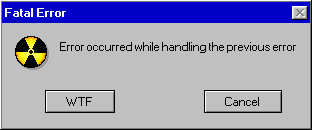
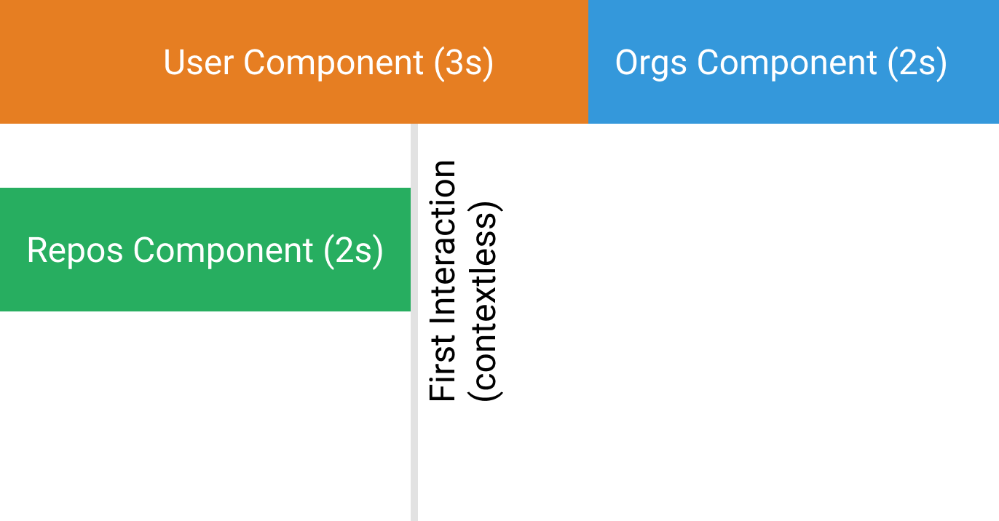
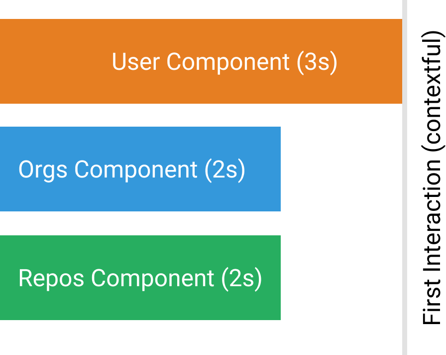
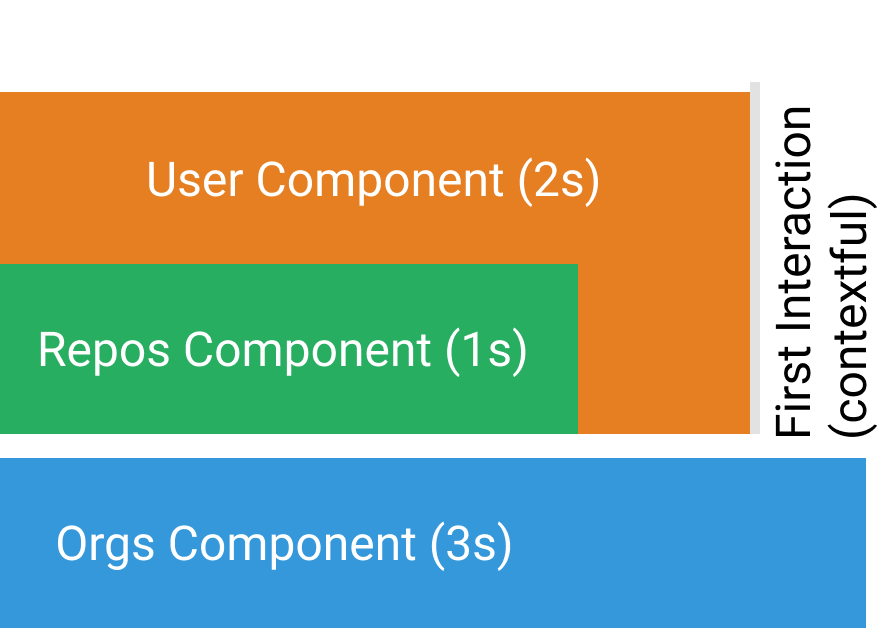

import { code } from 'mdx-deck/themes';
import { LiveCode } from 'mdx-deck-live-code';
import { Appear } from 'mdx-deck'

export const theme = code;
const alignLeft = { textAlign: "left" };

# Howdy:wave:, I'm Ameer Jhan
## @ameerthehacker
:heart_eyes: JavaScript, OSS and Microservices

---
### :microphone: Better UX with Suspense and :x: boundaries

---
## What is better UX :shrug:
<ul>
  <Appear>
    <li style={alignLeft}>Break gracefully (production code is not perfect)</li>
    <li style={alignLeft}>Faster first interaction</li>
    <li style={alignLeft}>Let the user know that something is happening</li>
    <li style={alignLeft}>Sensible content loading</li>
    <li style={alignLeft}>Adaptive design</li>
  </Appear>  
</ul>

---
## What is better DX :shrug:
<ul>
  <Appear>
    <li style={alignLeft}>Keeping things DRY (Hate copy pasting same code from stackoverflow twice)</li>
    <li style={alignLeft}>Being Declarative and not imperative</li>
    <li style={alignLeft}>Patterns with immediate feedback</li>
  </Appear>  
</ul>

---
## Better DX :keyboard: = Better UX :grinning:

---
## Let us build something :hammer:
<ul>
  <Appear>
    <li style={alignLeft}>A GitHub profile clone</li>
    <li style={alignLeft}>Progressively enhance UX</li>
  </Appear>  
</ul>

---
## :x: Error Boundary
<ul>
  <Appear>
    <li style={alignLeft}>They are kind of declarative try/catch</li>
    <li style={alignLeft}>Error boundaries don't catch errors in event handling</li>
  </Appear>  
</ul>

---
## Error in Error Boundary :shrug:

---
## Suspense for Lazy Loading
<Appear>
  <li style={alignLeft}>Provides fallback while lazy loading</li>
  <li style={alignLeft}><strong>React.Lazy</strong> and <strong>React.Suspense</strong> does not support <strong>SSR</strong> out of the box</li>
</Appear>

---
## Fetch as we render

---
## Fetch and render

---
## Render as we fetch

---
## Disclaimer :skull_and_crossbones:
* Suspense for data fetching is experimental
* Big no no for use in production

---
## Summary
- User error boundary to save yourself from unexpected errors
- Lazy load components with suspense to save some bytes for your users
- Use suspense data fetching to improve the loading UX (experimental)

---
# JSRealm
## @js_realm
JS Comunity at Hyderabad and Chennai.
Please do tweet and share with your friends

---
# Thank You :pray:

